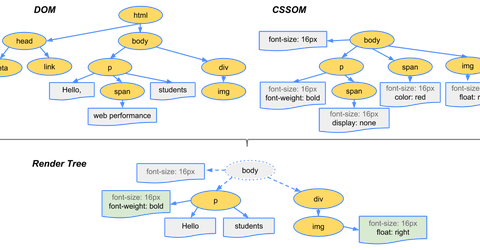
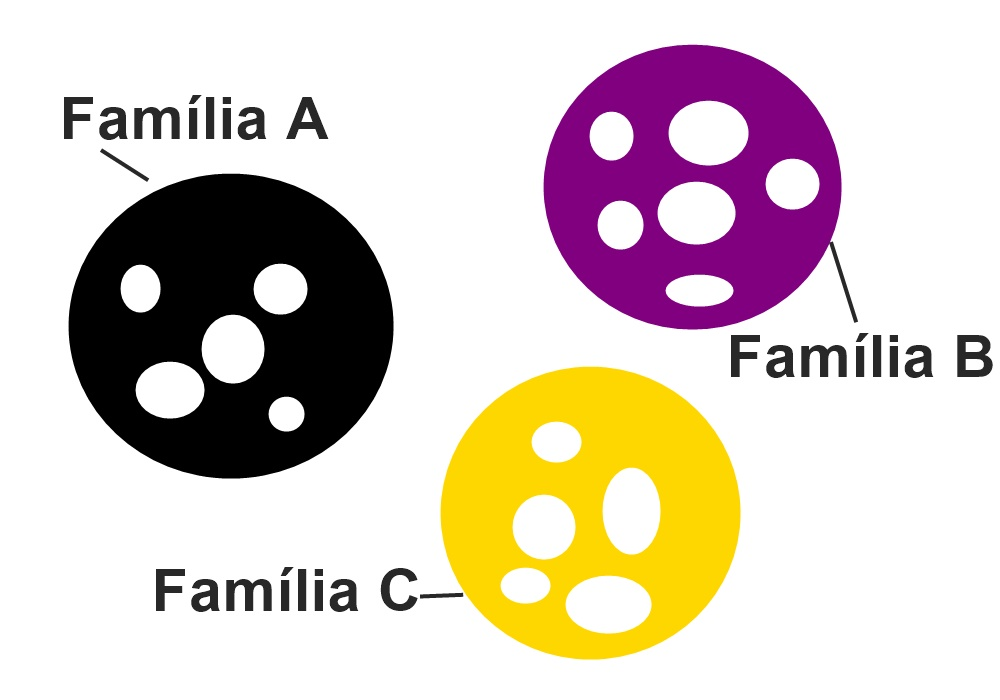

# Biologia aplicada para organizar folhas de estilo 

## DOM e Biologia

Não é segredo pra ninguém que no HTML podemos notar a presença de Bio, para entender melhor o que estou dizendo você pode observar que no DOM temos tags e uma hierarquia baseada nos organismos vivos. Quando falamos de Bio temos um amplo de coisas a serem estudadas, mas o que quero dizer aqui é que apesar de não mostrada a fundo em publico a Biologia contribuiu bastante para evolução da web. Para deixar claro as coisas vamos olhar a estrutura de um documento html
``` html
html -> Elemento raiz da família pai de head e body
 head -> Segundo elemento da arvore da família, pai de tags como title, link e meta tags  
 body -> Segundo elemento da arvore irmão de head e pai de elementos como divs, âncoras entre outras tags
  section -> Terceiro elemento da família do dom, essa tag pode ser pai de várias tags como divs, âncoras, iframes e etc
```
 Além das tags citadas acima temos membros não são capazes de prosseguir a ávore da família do DOM como as tags img e br, fechando assim a família do documento. 


## CSS organizado com ajuda de Biologia

 Antes de mostrar a possível metodologia com Biologia, eu gostaria de afirmar que tudo é possível desde que você saiba harmonizar corretamente as coisas como é o exemplo da metodologia Atomic Design. A metodologia foi desenvolvida pelo Brad Frost, ela se baseia em química. Nessa metodologia o desenvolvedor usa átomos, moléculas, organismos, modelos e páginas para construir com facilidade diversos projetos.  

## BIOCSS código organizado

No HTML temos o DOM e no CSS o CSSOM, o CSSOM é uma arvore da folha de estilo que lista todos os elementos da hierarquia do DOM, mas com proposito de customizar esses elementos. Para entender o DOM e CSSOM veja abaixo uma imagem que demonstra o funcionamento.



### O que é a BIOCSS?

 Metologia que usa como base algumas coisinhas de Biologia para organizar páginas levando em conta elementos presentes no DOM, listando assim membros da árvore famíliar. Como exemplo podemos okbservar as seguintes regras familiares para o desenvolvimento.

 

 Na imamgem acima vemos componentes de nossa folha de estilo separados por famílias A, B e C se formos para colocar em prática essa imagem ficaria algo do tipo:

 ```CSS
 Familia A
 header .container .row .col{
     ...
 } 
 Familia B 
 section .container .roe .col{
    ....
 }
 Familia C
 footer .container .row .col{
     ...
 }
``` 
Esse exemplo não é a metodologia aplicada, mas explicando a imagem acima dos grupos de família. O ponto da Metodologia, o BioCSS leva como base o modelo de reprodução de seres vivos até o fim da vida e processo de decomposição onde esse ser servirá como alimento para micro organismos.  

